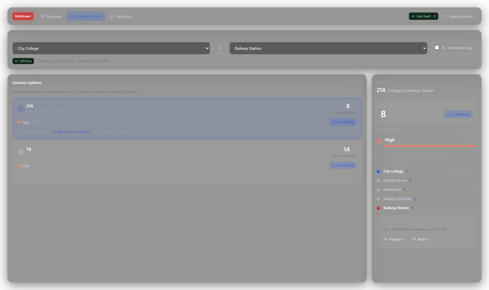
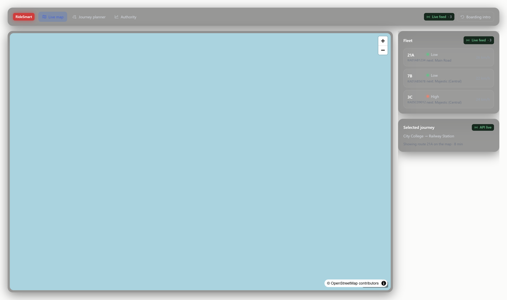
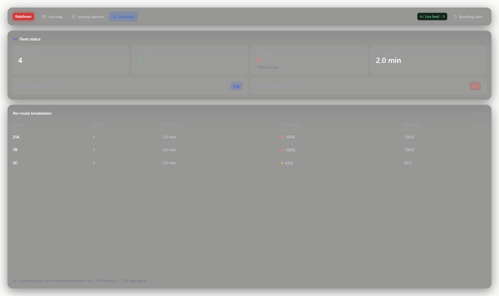

<div align="center">

# 🚌 RideSmart

**AI-Based Smart Public Transportation Platform**
Real-Time Bus Tracking · ETA Prediction · Crowd-Aware Route Planning

[](#-tech-stack)
[](#-tech-stack)
[](#-tech-stack)
[](#-testing)
[](#-license)

</div>

---

## 📖 Table of Contents

- [The Problem](#-the-problem)
- [Our Solution](#-our-solution)
- [Key Features](#-key-features)
- [Screenshots](#-screenshots)
- [Architecture](#-architecture)
- [Tech Stack](#-tech-stack)
- [Quickstart](#-quickstart)
- [Running the Simulator](#-running-the-simulator)
- [API Reference](#-api-reference)
- [Demo Script](#-demo-script)
- [Testing](#-testing)
- [Roadmap](#-roadmap)
- [Team](#-team)
- [Contributing](#-contributing)
- [SDG Alignment](#-sdg-alignment)
- [License](#-license)

---

## 😤 The Problem

Commuters face three blind spots on every single trip:

| Question | Today's answer |
|---|---|
| *Where is my bus right now?* | A static timetable and guesswork |
| *When will it actually arrive?* | The scheduled time, which is routinely wrong |
| *Will I even get a seat?* | No idea until you are already boarding |

Transport authorities have the mirror-image problem: **no visibility into demand,
delays, or which corridors are overloaded** — so buses are deployed where they
were needed yesterday.

## 💡 Our Solution

RideSmart closes the loop on both sides:

- **For passengers** — live positions, predicted arrival times, and
  **crowd-aware route recommendations** that surface *multiple* options so you
  can choose between *fast but packed* and *slightly slower but empty*.
- **For authorities** — a dashboard of active and delayed buses, plus the
  highest-demand and most crowded routes.

### ⭐ The Standout Feature

Most transit apps show you **one** route. RideSmart shows you the trade-off:

```text
You want:  VIT → Vellore Old Bus Stand

┌─ Option A ──────────────┐   ┌─ Option B ──────────────┐
│ Bus V1          🟡 MED  │   │ Bus V2          🟢 LOW   │
│ ETA          24 min     │   │ ETA           41 min     │
│ Crowd       35 / 50     │   │ Crowd        12 / 50    │
│ Delay       +1 min      │   │ Delay        +3 min     │
│ ♿ Wheelchair accessible │   │ Low-floor vehicle       │
└─────────────────────────┘   └─────────────────────────┘
            ▲ your choice
```

Neither option dominates. That is the entire point — the passenger decides what
matters to them right now, and the system is honest about the cost of each choice.

## ✨ Key Features

| # | Feature | Description | Owner |
|---|---------|-------------|-------|
| 1 | Live Tracking | Bus positions pushed in real time, rendered on a map | M1 · M2 |
| 2 | Route Planning | Journey A→B returning multiple ranked candidate routes | M2 |
| 3 | ETA Prediction | Arrival prediction from observed segment times, delay quantified | M1 |
| 4 | Crowd Estimation | Occupancy classified Low / Medium / High to guide route choice | M1 · M4 |
| 5 | Accessibility | Wheelchair access, low-floor and accessible-stop flags | M2 · M3 |
| 6 | Authority Dashboard | KPIs: active, delayed, high-demand and most crowded routes | M2 |
| 7 | Data Simulation | Buses driven along real OSM road geometry + crowd generator | M4 |

## 🗺️ Real Vellore–Katpadi map data

Stops and roads are real, not placeholders:

- **Region** — the Vellore–Katpadi corridor in Tamil Nadu: VIT in the north-east,
  down through Katpadi and the town centre to Bagayam and Christian Medical
  College in the south. All three routes run this spine, so they are genuine
  alternatives for the same journey.
- **Stops** — names and coordinates come from **OpenStreetMap** (Overpass API),
  snapped to well-known landmarks like VIT, Katpadi Junction and Vellore Old Bus
  Stand.
- **Roads** — every route's polyline comes from the **OSRM** routing service, so
  the line drawn on the map is the road the bus is actually on. Straight lines
  between stops would cut across buildings, lakes and parks.
- **Buses** — the simulator walks that polyline by distance travelled, not by
  interpolating between stop positions, so a 3.3 km leg correctly takes far
  longer than a 0.6 km one.

Fetched once by `simulation_ml/tools/build_real_routes.py` and committed to
`simulation_ml/data/real_routes.json`, so the running app makes **no external
network calls** and the demo works offline. Re-run the tool to refresh:

```bash
python -m simulation_ml.tools.build_real_routes
python -m simulation_ml.seed.seed --reset
```

The generator refuses to run if a landmark can no longer be snapped to a real OSM
node, which is what stops a plausible-but-wrong pin from ever reaching the
database.

The route codes (`V1`, `V2`, `M1`) and crowd profiles are demo data, not
official TNSTC routes or schedules. Map data © OpenStreetMap contributors
(ODbL).

## 📸 Screenshots

Captured against the running stack (API + simulator + Vite dev server).

| Journey planner | Live map | Authority dashboard |
|---|---|---|
|  |  |  |

The planner shot is the live `/app` console with a real plan returned by
`POST /api/routes/plan` (options sorted by ETA), the map shot has bus positions
arrived over the `/api/ws/buses` WebSocket, and the dashboard shot is fed by
`GET /api/authority/dashboard`.

## 🏗️ Architecture

```text
        Passenger (React Web App)
                  │
                  ▼
        ┌─────────────────────┐
        │   FastAPI Backend   │  ← REST + WebSocket
        │      (Member 2)     │
        └─────────────────────┘
                  │
   ┌──────────────┼──────────────┐
   ▼              ▼              ▼
Live Tracking  Route Planner  Crowd + Dashboard
  (Member 1)    (Member 2)      (Member 2)
   │              │              │
   └──────────────┼──────────────┘
                  ▼
        ┌─────────────────────┐
        │  Predictions / ML   │  ETA predictor · crowd estimator
        │      (Member 1)     │
        └─────────────────────┘
                  ▼
        ┌─────────────────────┐
        │  SQLite (dev) / PG  │  routes · stops · trips · telemetry
        │      (Member 4)     │
        └─────────────────────┘
                  ▲
                  │  writes telemetry
        ┌─────────────────────┐
        │  Bus Simulator      │  real-road movement + crowd
        │      (Member 4)     │
        └─────────────────────┘
```

**Repo layout** — each member owns one folder, one branch:

```text
ridesmart/
├── simulation_ml/    # M4  schema (SQLAlchemy models), seed data, bus simulator
├── database/         # FastAPI application: routers, schemas, services
│   ├── main.py       #     app factory, lifespan (create tables + seed), CORS
│   ├── api/          #     HTTP routers + /api/ws/buses WebSocket
│   ├── core/         #     engine/session wiring, settings
│   ├── schemas/      #     Pydantic request/response models
│   └── services/     #     planner, tracking, dashboard business logic
├── frontend/         # M3  React passenger app
├── tests_docs/       # M5  API contract, tests, docs, deployment
├── docker/           # M5  Dockerfiles
├── docker-compose.yml
└── .env.example
```

One application, one schema. `simulation_ml/db/models.py` is the single source of
truth for the 9 tables, and the API reads the exact same rows the simulator
writes, so there is no second copy of the data to keep in sync.

## 🛠️ Tech Stack

| Layer | Technology |
|-------|------------|
| Frontend | React 18, Vite, Tailwind CSS, MapLibre GL |
| Backend | Python 3.11, FastAPI, Uvicorn, Pydantic |
| Database | SQLite (dev), SQLAlchemy 2.x, portable to PostgreSQL |
| ML | pandas, numpy, scikit-learn |
| Simulation | Custom Python simulator (real-road telemetry) |
| Testing | pytest, pytest-asyncio, FastAPI TestClient |
| DevOps | Docker, Docker Compose |

## 🚀 Quickstart

**Prerequisites:** Python 3.11+, Node 18+, Docker (optional)

```bash
# 1. Clone
git clone https://github.com/yashwanth1211-cmd/ridesmart.git
cd ridesmart

# 2. Environment
cp .env.example .env

# 3. Python environment
python -m venv .venv
.\.venv\Scripts\activate        # Windows
# source .venv/bin/activate     # macOS / Linux

# 4. Install dependencies
pip install -r database/requirements.txt
pip install -r simulation_ml/requirements.txt

# 5. Seed the database  (3 routes, 19 real stops, 4 buses, 3 active trips)
#    Optional: the API seeds automatically on startup, so this is only needed
#    if you want the DB ready before the server starts.
python -m simulation_ml.seed.seed --reset

# 6. Start the API   → http://localhost:8000
uvicorn database.main:app --reload

# 7. Start the bus simulator, in a second terminal
python -m simulation_ml.simulate --speed 5 --interval 2

# 8. Start the frontend, in a third terminal
cd frontend && npm install && npm run dev    # → http://localhost:5173
```

**Verify it works:**
```bash
curl http://localhost:8000/api/health
# {"status":"ok","database":"ok",...}
```

### Docker alternative
```bash
docker compose up -d --build
curl http://localhost:8000/api/health
```

## 🚌 Running the Simulator

There is no real GPS feed, so the simulator is the live-tracking data source.

```bash
python -m simulation_ml.simulate --speed 5 --interval 2     # default, 5x real time
python -m simulation_ml.simulate --speed 20 --interval 1    # fast, for demos
python -m simulation_ml.simulate --once                    # single tick (used by tests)
python -m simulation_ml.simulate --push                    # POST to the API instead of writing the DB
```

It advances each active trip along its route, writes a `location` row per tick,
randomises speed so predictions diverge from the timetable, emits crowd readings
at each stop, and folds observed travel times back into `segment_stat` — which
means **ETA predictions visibly improve while the demo runs**.

## 🔌 API Reference

Base URL `http://localhost:8000` · Interactive docs at `/docs`

Full specification: [`tests_docs/api_contract.yaml`](tests_docs/api_contract.yaml) ·
Reference: [`tests_docs/docs/API.md`](tests_docs/docs/API.md)

| Method | Endpoint | Description | Owner |
|--------|----------|-------------|-------|
| `GET` | `/api/health` | Service health check | M2 |
| `GET` | `/api/routes` | All routes | M2 |
| `GET` | `/api/routes/{id}/stops` | Ordered stops for a route | M2 |
| `GET` | `/api/stops` | All stops (planner pickers) | M2 |
| `GET` | `/api/buses/active` | Latest position of every active bus | M2 |
| `POST` | `/api/buses/ingest` | Telemetry sink for `simulate --push` | M2 |
| `POST` | `/api/routes/plan` | **Plan A→B — returns ranked options** | M2 |
| `GET` | `/api/trips/{id}/eta` | Predicted arrival per stop | M2 |
| `PUT` | `/api/trips/{id}/crowd` | Override crowd level | M2 |
| `GET` | `/api/authority/dashboard` | Authority KPIs | M2 |
| `WS` | `/api/ws/buses` | Live position stream | M2 |

<details>
<summary><b>Example — plan a journey</b></summary>

```bash
curl -X POST http://localhost:8000/api/routes/plan \
  -H "Content-Type: application/json" \
  -d '{"from": "STOP_VIT", "to": "STOP_VELLORE_OLD_BUS_STAND"}'
```

```json
{
  "from": { "id": 1, "code": "STOP_VIT", "name": "VIT", "lat": 12.968142, "lon": 79.156252, "accessible": true },
  "to":   { "id": 6, "code": "STOP_VELLORE_OLD_BUS_STAND", "name": "Vellore Old Bus Stand", "lat": 12.92215, "lon": 79.13252, "accessible": true },
  "generated_at": "2026-10-03T05:17:07Z",
  "options": [
    {
      "route_id": 1,
      "code": "V1",
      "name": "VIT - Bagayam",
      "eta_min": 24,
      "eta_scheduled_min": 23,
      "eta_predicted_min": 24,
      "delay_min": 1,
      "crowd_level": "med",
      "crowd_load": 35,
      "capacity": 50,
      "crowd_ratio": 0.7,
      "wheelchair_accessible": true,
      "low_floor": true,
      "score": 66.0,
      "stops": [
        { "stop_id": 1, "name": "VIT", "eta_min": 24, "accessible": true },
        { "stop_id": 6, "name": "Vellore Old Bus Stand", "eta_min": 0, "accessible": true }
      ]
    },
    {
      "route_id": 2,
      "code": "V2",
      "name": "VIT - Otteri",
      "eta_min": 41,
      "eta_scheduled_min": 38,
      "eta_predicted_min": 41,
      "delay_min": 3,
      "crowd_level": "low",
      "crowd_load": 12,
      "capacity": 50,
      "crowd_ratio": 0.24,
      "wheelchair_accessible": false,
      "low_floor": false,
      "score": 55.4,
      "stops": [ "... stops ..." ]
    }
  ]
}
```

`options` is always sorted by `eta_min`, so `options[0]` is the quickest trip.
`stops[].eta_min` is *minutes remaining from boarding* for that stop, which is
why it counts down to `0` at your destination.

</details>

## 🎬 Demo Script

> ~3 minutes. Rehearse this before presenting.

1. **Open the app** — map shows buses moving live *(simulator running)*
2. **Plan a journey** VIT → Vellore Old Bus Stand
3. **Highlight the two options** — *"24 min but 🟡 packed, or 41 min and 🟢 empty"*
4. **Change a bus's crowd level** → re-plan → watch the ranking shift *(proves it is live, not static)*
5. **Authority dashboard** — delayed buses, most crowded route, demand score

## ✅ Testing

```bash
# run everything from the repo root
pytest tests_docs/tests -v

# only the API contract suite
pytest tests_docs/tests/test_smoke.py -v
```

Every test runs against a throwaway SQLite file created per test, so the suite
never touches your local `ridesmart.db` and can run in any order.

The suite is split by ownership:

- **Data-layer tests** — seed integrity, crowd banding, the demo contrast between
  V1 and V2, simulator movement and geometry, and that a bus wraps back around
  instead of freezing at the terminus.
- **API contract tests** — health, routes, stops, tracking, the planner, crowd
  override, dashboard and the WebSocket, asserted against `api_contract.yaml`.

The API tests **fail loudly** if `database/main.py` cannot be imported. They used
to *skip* in that situation, which quietly turned 13 broken endpoints into 13
"passing" skips, so a missing app is now a hard error.

Current status: **45 passed**.

## 🗺️ Roadmap

- [x] Repo structure and branch-per-member workflow
- [x] Database schema, seed data, segment statistics
- [x] Bus movement simulator with crowd generation
- [x] API contract and test suite
- [x] FastAPI application with live tracking endpoints
- [x] Journey planner returning ranked, crowd-aware options
- [x] ETA prediction on top of `segment_stat` historical timings
- [x] Crowd estimation and classification (`LOW` / `MED` / `HIGH`)
- [x] React frontend: map, planner, dashboard
- [x] WebSocket position streaming
- [x] Docker (API)
- [x] Screenshots in this README
- [x] CI workflow

## 👥 Team

| Member | Branch | Folder | Responsibility |
|--------|--------|--------|----------------|
| 1 | `member1-backend` | merged into `database/` | Bus tracking, ETA and crowd service design (see integration notes) |
| 2 | `member2-database` | `database/` | FastAPI app, routers, WebSocket |
| 3 | `member3-frontend` | `frontend/` | React passenger app |
| 4 | `member4-simulation_ml` | `simulation_ml/` | Database, seed data, simulator |
| 5 | `member5-tests_docs` | `tests_docs/`, `database/` | API contract, tests, CI, docs, deployment, integration |

M1 and M2 each shipped a complete FastAPI app with its own schema. During
integration only one app was kept — M2's `database/` — because its router layout
matched the agreed contract. M1's endpoint logic was folded into
`database/services/`, and `backend/` was removed so there is a single app to run
and a single set of tables to reason about. `tests_docs/docs/INTEGRATION_REVIEW.md`
records what was kept, what was dropped, and why.

## 🤝 Contributing

1. Work **only** inside your assigned folder and branch.
2. `git switch <your-branch>` before changing anything.
3. Code against [`tests_docs/api_contract.yaml`](tests_docs/api_contract.yaml) — if
   the code and the contract disagree, that is a bug. Raise it in the group chat.
4. Import ORM models from `simulation_ml/db/models.py`; do not redeclare them.
5. Commit small and often, and push only your own branch.
6. Open a Pull Request into `main` when your feature is complete.

## 🌱 SDG Alignment

| SDG | Contribution |
|-----|--------------|
| **11** — Sustainable Cities & Communities | Encourages public transit over private vehicles, easing congestion |
| **9** — Industry, Innovation & Infrastructure | Applied ML for transport efficiency and fleet deployment |
| **10** — Reduced Inequalities | Accessibility data serves disabled, elderly and visually impaired riders |

## 📄 License

MIT © 2026 RideSmart